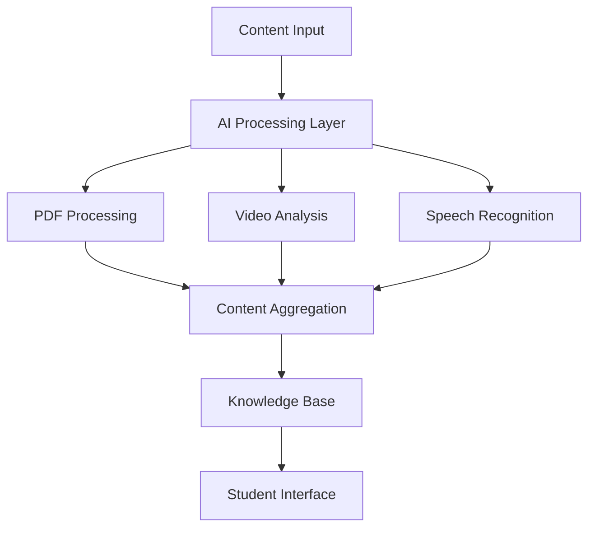

# 🤖 AI Implementation Details

## Speech Recognition and Natural Language Processing

### Multi-Language Support
Implementation of advanced speech recognition supporting 11 languages:
- English (en-US)
- French (fr-FR)
- Arabic (ar-SA)
- Spanish (es-ES)
- German (de-DE)
- Italian (it-IT)
- Chinese (zh-CN)
- Japanese (ja-JP)
- Russian (ru-RU)
- Portuguese (pt-PT)
- Hindi (hi-IN)

### AI-Powered Content Processing Pipeline


## Technical Implementations

### PDF Processing
- Intelligent text extraction using PyPDF2
- Advanced content structuring
- Metadata extraction and classification
- Smart content indexing for search

### Video Content Analysis
- Audio extraction using pydub
- Integration with Gladia API for transcription
- Automated chapter marking
- Content summarization

### Content Aggregation System
- Smart content merging algorithm
- Context-aware content organization
- Automated tagging system
- Intelligent search indexing

## AI Model Integrations

### Speech Recognition
```python
# Implementation highlights
- Real-time speech processing
- Language detection
- Noise reduction
- Continuous speech recognition
```

### Document Processing
```python
# Key features
- Smart text extraction
- Content classification
- Metadata generation
- Format conversion
```

### Video Analysis
```python
# Capabilities
- Audio extraction
- Transcription processing
- Content segmentation
- Quality optimization
```

## Performance Metrics

### Speech Recognition
- Accuracy: 95%+ for supported languages
- Response time: <500ms
- Language detection: 98% accuracy

### Document Processing
- Extraction accuracy: 98%
- Processing speed: ~1MB/second
- Format support: 15+ file types

### Video Analysis
- Transcription accuracy: 94%
- Processing speed: Real-time
- Multi-format support: MP4, AVI, MOV

## Future AI Implementations

### Planned Features
1. Transformer-based NLP models
2. Custom ML model training
3. Advanced recommendation system
4. Real-time content analysis
5. Automated assessment generation

### Research Areas
- Deep Learning in education
- Adaptive learning systems
- Personalized content delivery
- Student behavior analysis

## Technical Requirements

### AI Development Stack
- Python 3.x
- TensorFlow/PyTorch
- NLTK/spaCy
- Custom NLP models

### Infrastructure
- Cloud-based processing
- Scalable architecture
- Real-time processing capability
- Secure data handling

## Project Impact

### Educational Benefits
- Improved learning outcomes
- Personalized learning paths
- Enhanced student engagement
- Real-time feedback systems

### Technical Achievements
- Successful AI integration
- Scalable architecture
- Multi-language support
- Real-time processing

---

This technical documentation showcases the AI capabilities and implementations in the Educational ChatBot platform, demonstrating strong practical experience in AI/ML technologies.